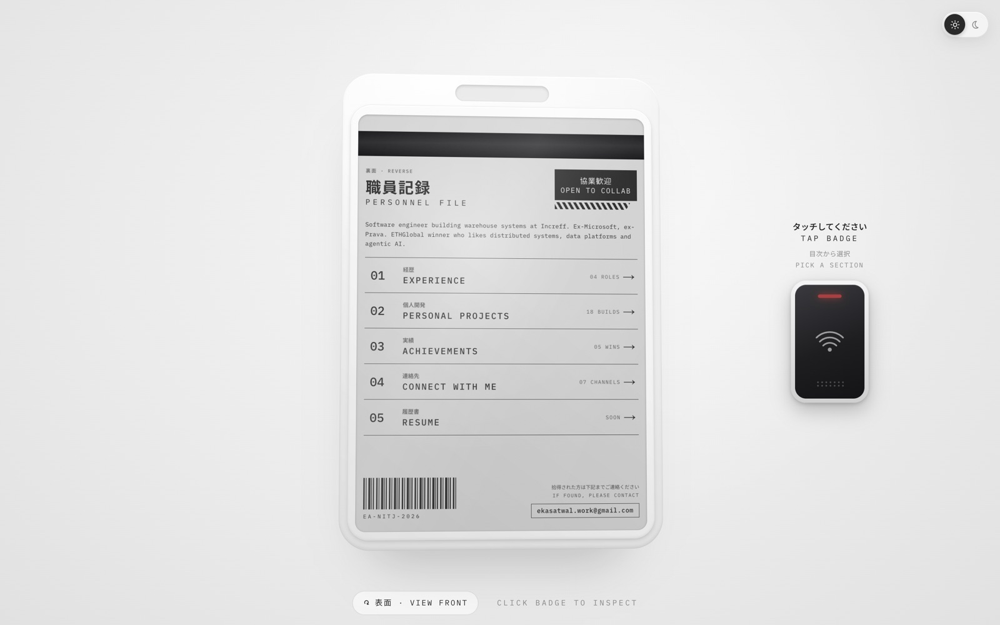
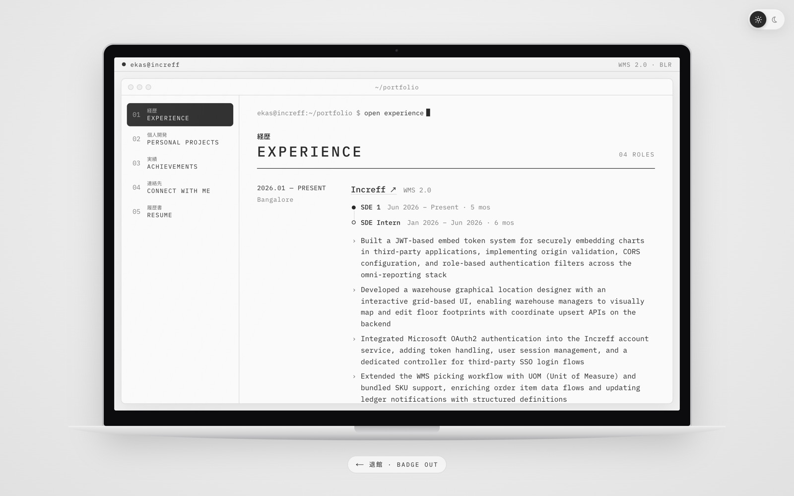
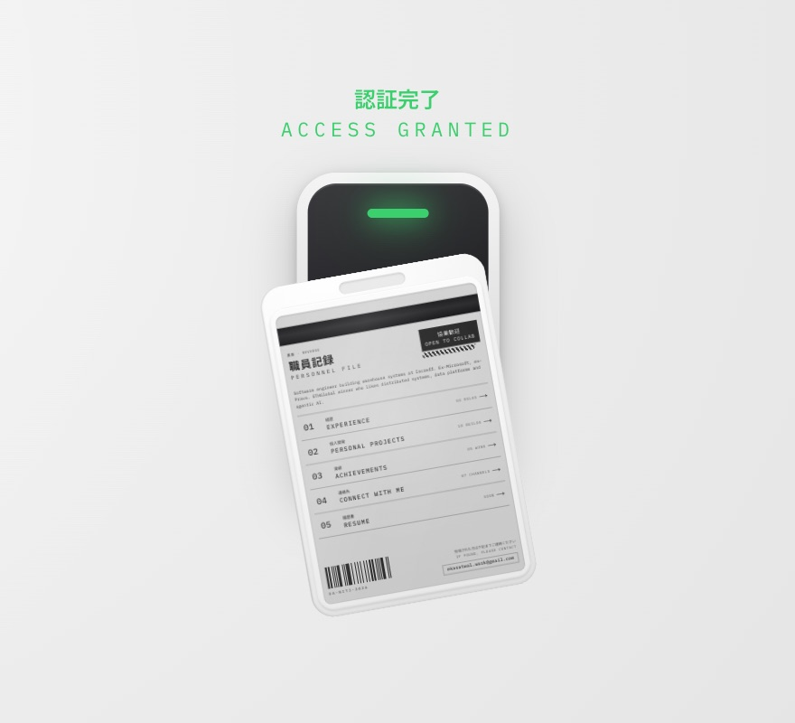
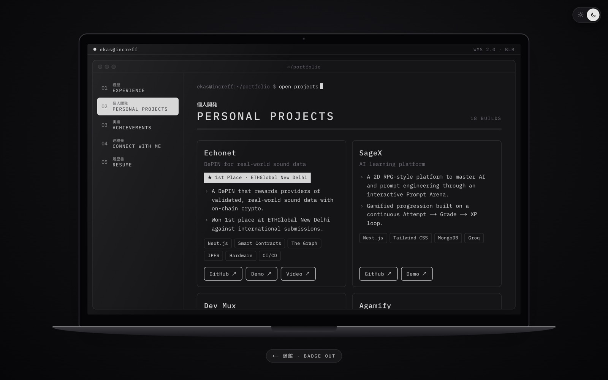
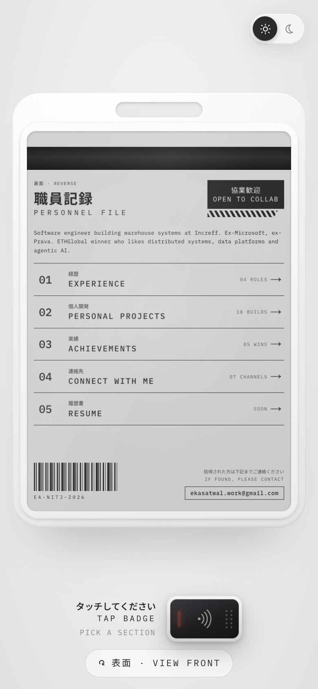
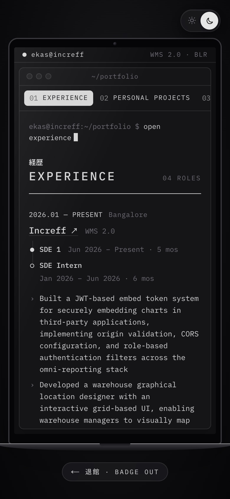

# Ekaspreet Singh Atwal — Portfolio

An interactive 3D employee ID badge that doubles as my portfolio. It tilts toward your cursor and catches light like glossy plastic. Flip it to see an index of sections, then tap it on the card reader. The door to the engineering room closes, and that section opens on a laptop inside.

Software Engineer at **Increff** (WMS 2.0) · NIT Jalandhar alum · previously SDE Intern at **Microsoft** and **Prava Payments**.

<table>
  <tr>
    <td></td>
    <td></td>
  </tr>
  <tr>
    <td align="center">Front</td>
    <td align="center">Front, dark theme</td>
  </tr>
  <tr>
    <td></td>
    <td></td>
  </tr>
  <tr>
    <td align="center">Back, with the card reader</td>
    <td align="center">A section on the laptop</td>
  </tr>
</table>

## Features

**The badge**

- **3D tilt and parallax.** The badge rotates and drifts toward the cursor anywhere in the viewport using CSS 3D transforms, with stacked edge layers that give the plastic case real thickness.
- **Dynamic glare.** A specular hotspot, a glossy streak and a soft shadow move across the surface based on cursor angle and distance.
- **Spring physics.** Every movement is spring-driven, so the badge has weight and inertia instead of snapping.
- **Click to zoom.** Clicking zooms the badge to a detail view that pans with the cursor; click anywhere or press <kbd>Esc</kbd> to return. The badge is rendered at 2× and scaled down at rest, so text stays crisp when zoomed.
- **Two sides.** The front is the ID card, with working links to the company, college, office location and socials. The back is a personnel file that lists every section with a live count, such as "04 ROLES" or "18 BUILDS". Press the button under the badge, or <kbd>F</kbd>, to flip it.

**Badging in**

- **Tap to enter.** Picking a section on the back flies the badge onto the card reader. The reader beeps, its light turns from red to green, and it shows ACCESS GRANTED.
- **Door transition.** The two halves of the door slide shut, the section's page loads, and the doors open again onto the room. The opening is pure CSS, so it plays before the page has finished loading its JavaScript.
- **Laptop rooms.** Each section is its own page, shown on a laptop screen with a terminal prompt and a sidebar for moving between sections. Moving between sections doesn't replay the door. Badge out takes you back to the flipped badge.
- **Sections.** Experience (a timeline of roles and promotions), personal projects (featured cards plus a list of smaller builds), achievements (hackathons, competitive programming, certifications), a contact page and the resume.

**Everywhere**

- **Light and dark themes.** The toggle in the top-right corner switches themes with a circular reveal. The choice is remembered, defaults to the system setting, and never flashes the wrong theme on load.
- **Content from JSON.** Everything on the badge, the reader, the door and the laptop lives in JSON files.
- **Responsive and accessible.** Laid out for phones, tablets, landscape phones and desktops, works with the keyboard, and respects `prefers-reduced-motion`. With reduced motion, the badge skips the flight and door and goes straight to the section.

## Screenshots

**Badging in.** The badge lands on the reader and the light turns green.



**Laptop rooms.** Personal projects in the dark theme.



**Zoomed detail view.** Moving the cursor pans across the card.

<table>
  <tr>
    <td></td>
    <td></td>
  </tr>
</table>

**Theme switch.** The new theme spreads out from the toggle.


**Mobile.** On phones the reader sits under the badge and the laptop becomes a tall screen with a scrolling tab strip.

<table>
  <tr>
    <td></td>
    <td></td>
    <td></td>
  </tr>
</table>

## Tech stack

- [Next.js 16](https://nextjs.org) (App Router) with React 19 and TypeScript. Every section page is statically generated.
- [Motion](https://motion.dev) (Framer Motion) for spring physics and the tap animation
- CSS Modules with CSS 3D transforms, container queries, blend modes and the View Transitions API
- Web Audio API for the reader sound, started on the click so browsers allow it
- Tailwind CSS v4 for global styles
- Fonts: Noto Sans JP and IBM Plex Mono via `next/font`

## Getting started

Requires Node.js 20.9 or newer.

```bash
npm install
npm run dev
```

Then open [http://localhost:3000](http://localhost:3000).

| Command         | What it does                     |
| --------------- | -------------------------------- |
| `npm run dev`   | Start the development server     |
| `npm run build` | Create a production build        |
| `npm run start` | Serve the production build       |
| `npm run lint`  | Run ESLint                       |

## Editing content

All content is JSON, and every file is typed, so a typo or missing field fails the type check.

### The badge, reader, door and laptop

These live in [`src/content/profile.json`](src/content/profile.json), typed in [`src/content/profile.ts`](src/content/profile.ts).

| Key              | What it controls                                                        |
| ---------------- | ----------------------------------------------------------------------- |
| `meta`           | Page title and description                                              |
| `badge.portrait` | Portrait image and alt text                                             |
| `badge.status`   | The VERIFIED stamp                                                      |
| `badge.fields`   | Department and title rows (Japanese and English)                        |
| `badge.name`     | Name in katakana and English                                            |
| `badge.logo`     | Company logo in the center of the grid                                  |
| `badge.details`  | The two columns of detail cells beside the logo                         |
| `badge.division` | Text on the bottom stripe                                               |
| `back`           | The back of the badge: title, stamp, summary, contact and serial        |
| `back.index`     | Which sections appear on the back, and in what order                    |
| `office.reader`  | The reader's idle, hint and granted text, and the path to its sound     |
| `office.door`    | Room name and notice on the door sign                                   |
| `office.laptop`  | Hostname and status in the laptop's menu bar                            |
| `office.exit`    | Label on the badge-out button                                           |

Any detail cell with an `href` becomes a link that opens in a new tab:

```json
{ "label": "GITHUB", "value": "ekas-7", "href": "https://github.com/ekas-7" }
```

Images live in [`public/badge/`](public/badge). The portrait is a transparent PNG, so the card's own colour shows behind it in both themes.

### Sections

Each section has its own file in [`src/content/sections/`](src/content/sections), typed in [`src/content/sections.ts`](src/content/sections.ts).

| File                | What it holds                                                                   |
| ------------------- | ------------------------------------------------------------------------------- |
| `experience.json`   | Roles, each with one or more positions (title, start, end), highlights, stack and links, plus education |
| `projects.json`     | Projects with a tagline, highlights, stack and links. `featured: true` shows a project as a large card |
| `achievements.json` | Hackathons, competitive programming, security, academics, certifications, clubs |
| `connect.json`      | Pitch, email and contact links                                                  |
| `resume.json`       | Path to the resume PDF. While `file` is `null`, the page offers to email a copy |
| `skills.json`       | Skill groups shown under experience                                             |

A position with `"end": null` reads as "Present", and tenure in months is worked out from the dates. In a highlight, any text before " – " is shown in bold.

To hide or reorder sections, edit `back.index`. The back of the badge, the laptop's sidebar and the generated pages all follow it.

## Project structure

```
src/
├── app/
│   ├── layout.tsx            # fonts, metadata, theme script, theme toggle
│   ├── page.tsx              # renders the badge
│   ├── globals.css
│   └── (office)/
│       ├── layout.tsx        # laptop and opening door, kept across sections
│       └── [section]/page.tsx  # one static page per section
├── components/
│   ├── id-badge/             # 3D badge: motion, glare, zoom, flip, tap to enter
│   ├── card-reader/          # reader plate, status text, reader sound
│   ├── door/                 # sliding door for the closing and opening transition
│   ├── office/               # laptop frame, sidebar and section screens
│   └── theme-toggle/         # toggle, circular reveal, pre-paint theme script
└── content/
    ├── profile.json          # badge, back, reader, door and laptop content
    ├── profile.ts            # types for profile.json
    ├── sections.ts           # section types, index and counts
    └── sections/             # one JSON file per section
public/
├── badge/                    # portrait and logo
└── sfx/                      # card reader sound
```

## Credits

Badge design inspired by a Japanese-style ID card concept by Adi. Increff logo © Increff.

Card reader sound: [Electronic Door Opening](https://freesound.org/people/alegemaate/sounds/364688/) by alegemaate, CC0, via Freesound.
