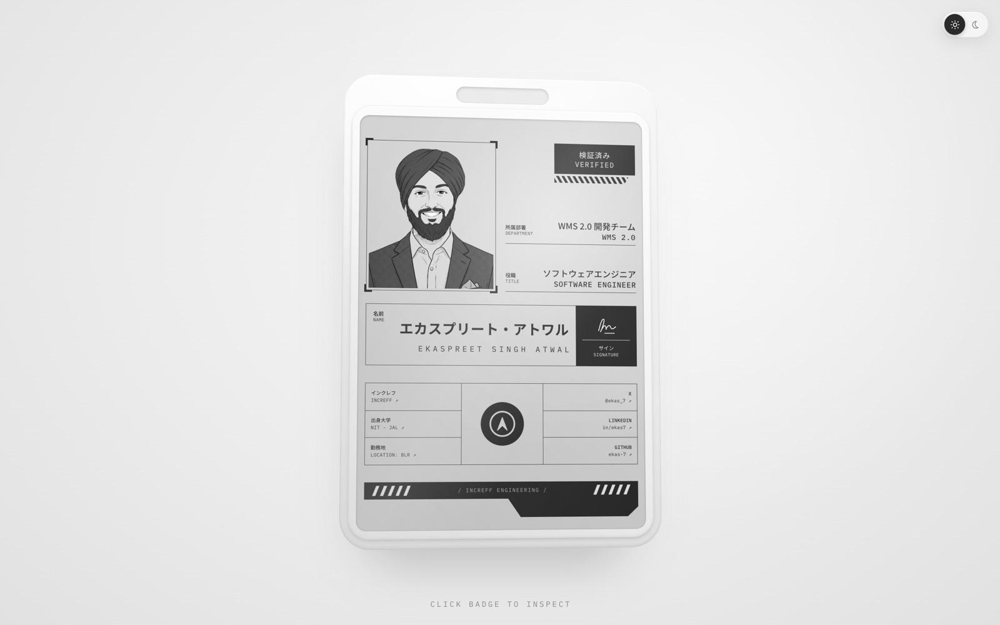
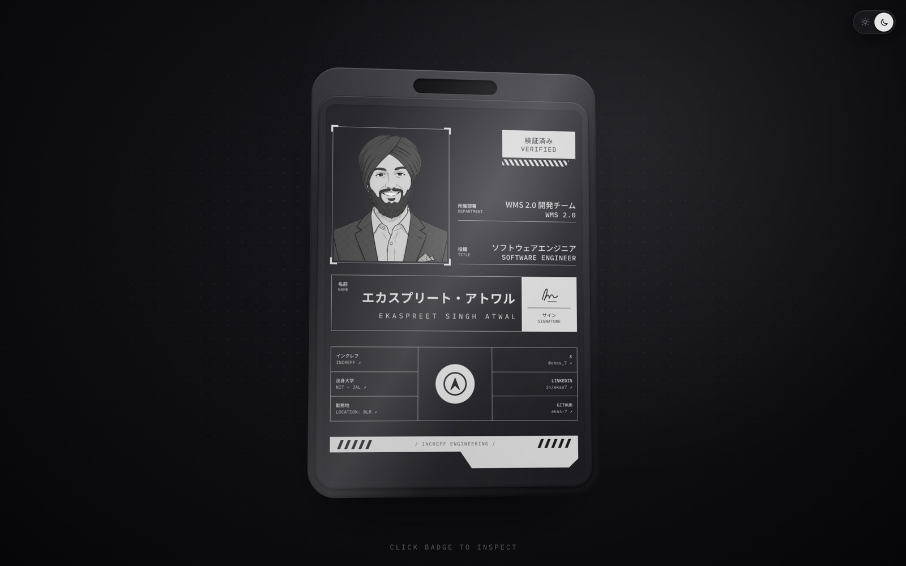
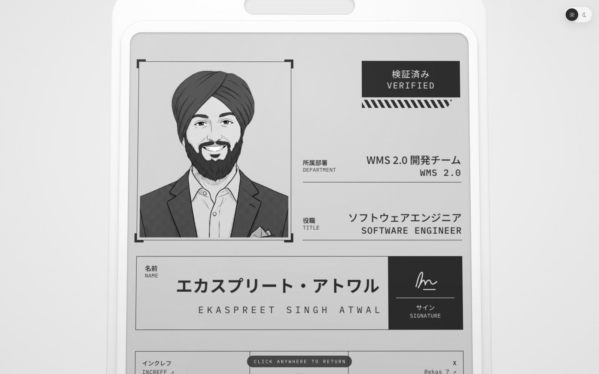
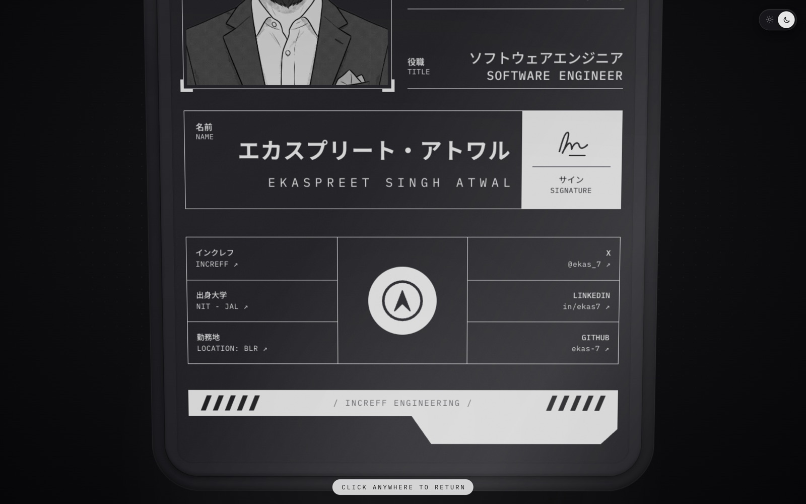
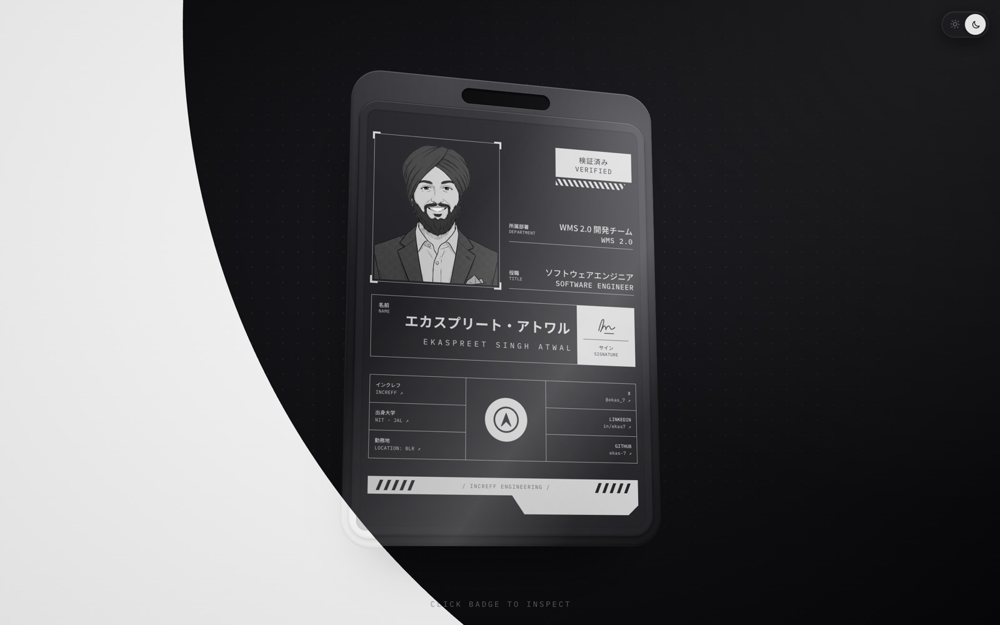
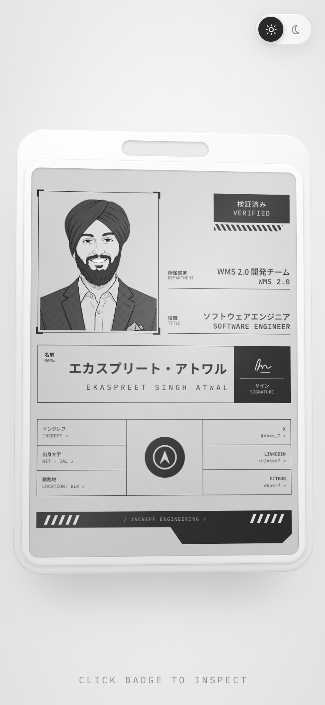
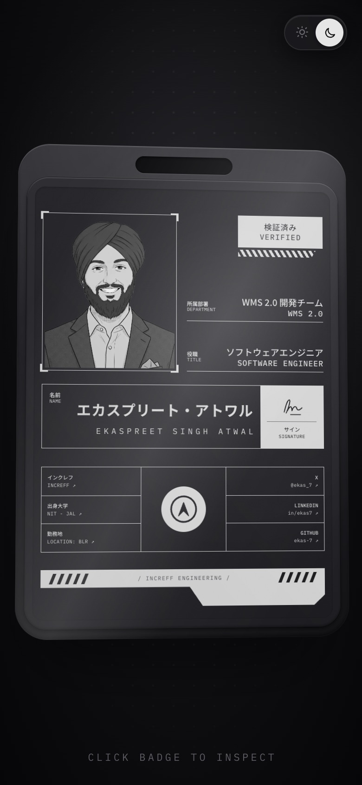

# Ekaspreet Singh Atwal — Portfolio

An interactive 3D employee ID badge that doubles as my portfolio. It tilts toward your cursor, catches light like glossy plastic, zooms in when clicked, and links out to everything that matters.

Software Engineer at **Increff** (WMS 2.0) · NIT Jalandhar alum · previously SDE Intern at **Microsoft** and **Prava Payments**.

<table>
  <tr>
    <td></td>
    <td></td>
  </tr>
  <tr>
    <td align="center">Light</td>
    <td align="center">Dark</td>
  </tr>
</table>

## Features

- **3D tilt and parallax.** The badge rotates and drifts toward the cursor anywhere in the viewport using CSS 3D transforms, with stacked edge layers that give the plastic case real thickness.
- **Dynamic glare.** A specular hotspot, a glossy streak and a soft shadow move across the surface based on cursor angle and distance.
- **Spring physics.** Every movement is spring-driven, so the badge has weight and inertia instead of snapping.
- **Click to zoom.** Clicking zooms the badge to a detail view that pans with the cursor; click anywhere or press <kbd>Esc</kbd> to return. The badge is rendered at 2× and scaled down at rest, so text stays crisp when zoomed.
- **Working links.** Company, college, office location (Google Maps) and X / LinkedIn / GitHub are clickable right on the card.
- **Light and dark themes.** The toggle in the top-right corner switches themes with a circular reveal. The choice is remembered, defaults to the system setting, and never flashes the wrong theme on load.
- **Content from JSON.** Everything printed on the badge lives in a single JSON file.
- **Responsive and accessible.** Scales to any screen, works with the keyboard, and respects `prefers-reduced-motion`.

## Screenshots

**Zoomed detail view.** Moving the cursor pans across the card.

<table>
  <tr>
    <td></td>
    <td></td>
  </tr>
</table>

**Theme switch.** The new theme spreads out from the toggle.



**Mobile**

<table>
  <tr>
    <td></td>
    <td></td>
  </tr>
</table>

## Tech stack

- [Next.js 16](https://nextjs.org) (App Router) with React 19 and TypeScript
- [Motion](https://motion.dev) (Framer Motion) for spring physics
- CSS Modules with CSS 3D transforms, blend modes and the View Transitions API
- Tailwind CSS v4 for global styles
- Fonts: Noto Sans JP and IBM Plex Mono via `next/font`

## Getting started

Requires Node.js 20.9 or newer.

```bash
npm install
npm run dev
```

Then open [http://localhost:3000](http://localhost:3000).

| Command         | What it does                     |
| --------------- | -------------------------------- |
| `npm run dev`   | Start the development server     |
| `npm run build` | Create a production build        |
| `npm run start` | Serve the production build       |
| `npm run lint`  | Run ESLint                       |

## Editing the badge

All badge content lives in [`src/content/profile.json`](src/content/profile.json), and its shape is typed in [`src/content/profile.ts`](src/content/profile.ts), so a typo or missing field fails the type check.

| Key                | What it controls                                                  |
| ------------------ | ----------------------------------------------------------------- |
| `meta`             | Page title and description                                        |
| `badge.portrait`   | Portrait image and alt text                                       |
| `badge.status`     | The VERIFIED stamp                                                |
| `badge.fields`     | Department and title rows (Japanese and English)                  |
| `badge.name`       | Name in katakana and English                                      |
| `badge.logo`       | Company logo in the center of the grid                            |
| `badge.details`    | The two columns of detail cells beside the logo                   |
| `badge.division`   | Text on the bottom stripe                                         |

Any detail cell with an `href` becomes a link that opens in a new tab:

```json
{ "label": "GITHUB", "value": "ekas-7", "href": "https://github.com/ekas-7" }
```

Images live in [`public/badge/`](public/badge). The portrait is a transparent PNG, so the card's own colour shows behind it in both themes.

## Project structure

```
src/
├── app/
│   ├── layout.tsx            # fonts, metadata, theme script, theme toggle
│   ├── page.tsx              # renders the badge
│   └── globals.css
├── components/
│   ├── id-badge/             # 3D badge: motion, glare, zoom, card layout
│   └── theme-toggle/         # toggle, circular reveal, pre-paint theme script
└── content/
    ├── profile.json          # all badge content
    └── profile.ts            # types for profile.json
```

## Credits

Badge design inspired by a Japanese-style ID card concept by Adi. Increff logo © Increff.

Card reader sound: [Electronic Door Opening](https://freesound.org/people/alegemaate/sounds/364688/) by Allan Legemaate (alegemaate), CC0, via Freesound.
